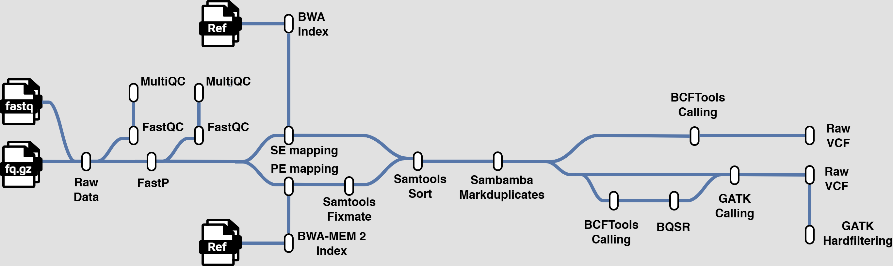

# NGS Variant Calling Nextflow Pipeline



A containerized, modular **Nextflow DSL2** pipeline for **non-human WGS variant calling**.

- **Nextflow**: `25.10.4`
- **Runtime**: Apptainer/Singularity
- **Container image**: `WGS_Variant_Calling.sif` (override with `--sif`)
- **Main flow**: `Raw_QC -> Trimming_QC -> Aligning -> Calling`

## Quick Start (Read This First)

1. Check help:

```bash
nextflow run main.nf --help
```

2. Run full pipeline locally:

```bash
nextflow run main.nf \
  -profile local \
  --input_dir /data/fastq \
  --ref /data/ref.fa \
  --read_type PE \
  --run_step all \
  --caller gatk \
  --use_bqsr false \
  --threads 8
```

3. Output root:

- `results/`

## Input Requirements

Required:

- `--input_dir`: directory containing FASTQ files
- `--ref`: reference FASTA

Sample ID inference:

- PE: strip `_R1.fastq.gz` / `_R2.fastq.gz` or `_R1.fq.gz` / `_R2.fq.gz`
- SE: strip `.fastq.gz` or `.fq.gz`

Example input naming:

- PE:
  - `Aq01_R1.fastq.gz`
  - `Aq01_R2.fastq.gz`
  - `Aq02_R1.fastq.gz`
  - `Aq02_R2.fastq.gz`
- SE:
  - `Aq01.fastq.gz`
  - `Aq02.fq.gz`

## Execution Modes

Full run:

```bash
nextflow run main.nf --run_step all ...
```

Single-step run:

```bash
nextflow run main.nf --run_step Raw_QC ...
nextflow run main.nf --run_step Trimming_QC ...
nextflow run main.nf --run_step Aligning ...
nextflow run main.nf --run_step Calling ...
```

Behavior notes:

- `Aligning` reuses Step2 outputs in `results/02_fastp_qc/fastp` if complete; otherwise it runs fastp.
- `Calling` reuses Step3 outputs in `results/04_markdup` if complete; if not, it falls back to Step2 outputs, then to fresh fastp+alignment.

## Workflow Logic

Step1 `Raw_QC`:

- FastQC on raw FASTQ
- MultiQC summary

Step2 `Trimming_QC`:

- fastp
- FastQC on cleaned FASTQ
- MultiQC summary

Step3 `Aligning`:

- `SE`: `bwa index -> bwa mem -> samtools sort -> sambamba markdup`
- `PE`: `bwa-mem2 index -> bwa-mem2 mem -> samtools fixmate -> samtools sort -> sambamba markdup`

Step4 `Calling` (parallel by chromosome/scaffold from FASTA headers):

- `caller=bcftools`:
  - per-interval calling
  - merge into one final multisample cohort VCF
- `caller=gatk --use_bqsr false`:
  - HaplotypeCaller (per interval)
  - GenomicsDBImport (per interval)
  - GenotypeGVCFs (per interval)
  - merge raw VCFs
  - SNP/INDEL hard filtering
  - merge filtered SNP+INDEL
- `caller=gatk --use_bqsr true`:
  - bcftools seed call (per interval) + merge
  - high-confidence SNP extraction for BQSR known-sites
  - BaseRecalibrator + ApplyBQSR on full BAM
  - then same GATK per-interval chain and final filtering as above

## Results Structure

```text
results/
├── 01_raw_qc/
│   ├── fastqc/
│   └── multiqc/
├── 02_fastp_qc/
│   ├── fastp/
│   ├── fastqc/
│   └── multiqc/
├── 03_align/
├── 04_markdup/
└── 05_variant_calling/
    ├── bcftools/
    │   ├── per_chrom/
    │   └── cohort.bcftools.vcf.gz(.tbi)
    └── gatk/
        ├── bqsr/
        ├── haplotypecaller/per_chrom/
        ├── genomicsdb/per_chrom/
        ├── genotypegvcfs/per_chrom/
        ├── genotypegvcfs/cohort.gatk.raw.vcf.gz(.tbi)
        └── filter/cohort.gatk.filtered.vcf.gz(.tbi)
```

Typical filenames:

- `SAMPLE.sorted.bam`
- `SAMPLE.markdup.bam`
- `cohort.bcftools.vcf.gz`
- `cohort.gatk.filtered.vcf.gz`

## Parameters

Core controls:

- `--run_step`: `Raw_QC|Trimming_QC|Aligning|Calling|all` (default: `all`)
- `--read_type`: `SE|PE` (default: `PE`)
- `--caller`: `bcftools|gatk` (default: `bcftools`)
- `--use_bqsr`: `true|false` (default: `false`)
- `--help`: print help and exit

Extra tool args:

- `--fastp_parameters`
- `--bwa_parameters`
- `--bwamem2_parameters`
- `--bcftools_mpileup_parameters`
- `--bcftools_call_parameters`
- `--bcftools_concat_parameters`
- `--gatk_haplotypecaller_parameters`
- `--gatk_genomicsdbimport_parameters`
- `--gatk_genotypegvcfs_parameters`
- `--gatk_baserecalibrator_parameters`
- `--gatk_applybqsr_parameters`
- `--gatk_variantfiltration_snp_parameters`
- `--gatk_variantfiltration_indel_parameters`

Note: `--bcftools_*_parameters` affect both Step4 `caller=bcftools` and the BQSR seed-calling path under `caller=gatk --use_bqsr true`.

Container:

- `--sif`: container image path

Resource controls:

- `--threads`: global fallback threads (default: `4`)
- Tool-specific overrides:
  - `--fastqc_cpus`
  - `--fastp_cpus`
  - `--bwa_cpus`
  - `--bwamem2_cpus`
  - `--sambamba_cpus`
  - `--bcftools_cpus`
  - `--gatk_cpus`

## Profile Switching

Select executor profile with `-profile`:

- `local`: local execution
- `slurm`: SLURM scheduler
- `awsbatch`: AWS Batch

Example:

```bash
nextflow run main.nf -profile local ...
nextflow run main.nf -profile slurm ...
nextflow run main.nf -profile awsbatch ...
```

SLURM parameters (`-profile slurm`):

- `--slurm_queue`
- `--slurm_account`
- `--slurm_qos`
- `--slurm_time`
- `--slurm_constraint`
- `--slurm_extra` (default includes memory request)
- `--slurm_queue_size`

AWS Batch parameters (`-profile awsbatch`):

- `--aws_region` (default: `us-east-1`)
- `--aws_queue`
- `--aws_workdir`
- `--aws_container`
- `--aws_cli_path`

## Typical Commands

Calling only with bcftools:

```bash
nextflow run main.nf \
  -profile local \
  --input_dir /data/fastq \
  --ref /data/ref.fa \
  --run_step Calling \
  --caller bcftools \
  --threads 4
```

Calling only with GATK + BQSR:

```bash
nextflow run main.nf \
  -profile local \
  --input_dir /data/fastq \
  --ref /data/ref.fa \
  --run_step Calling \
  --caller gatk \
  --use_bqsr true \
  --threads 4
```

SLURM example:

```bash
nextflow run main.nf \
  -profile slurm \
  --input_dir /data/fastq \
  --ref /data/ref.fa \
  --run_step Calling \
  --caller gatk \
  --use_bqsr true \
  --slurm_queue cpu \
  --slurm_account my_account \
  --slurm_time 48h \
  --threads 8
```

AWS Batch example:

```bash
nextflow run main.nf \
  -profile awsbatch \
  --input_dir /data/fastq \
  --ref /data/ref.fa \
  --run_step Calling \
  --caller bcftools \
  --aws_queue my-queue \
  --aws_workdir s3://my-bucket/nf-work \
  --aws_container 123456789012.dkr.ecr.us-east-1.amazonaws.com/wgs:latest \
  --aws_region us-east-1 \
  --threads 4
```

## Software Scope (Intentional Constraints)

Included only:

- FastQC
- MultiQC
- fastp
- bwa
- bwa-mem2
- samtools
- sambamba
- bcftools
- GATK


## Reproducibility Notes

- Every process declares `container`.
- Workflow report/trace/timeline/DAG are written under `pipeline_info/`.
- Intermediate task files are under `work/`.
