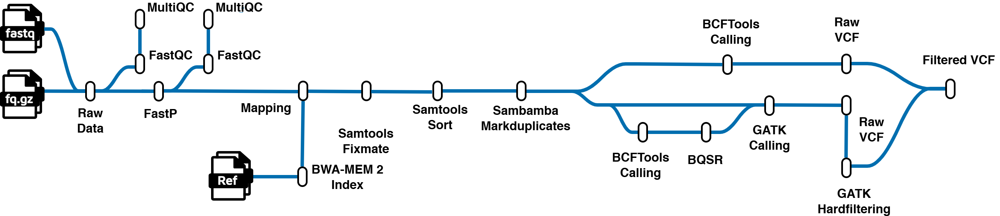

# NGS Variant Calling Nextflow Pipeline



A containerized, modular **Nextflow DSL2** pipeline for **non-human WGS variant calling**.

- **Nextflow**: `25.10.4`
- **Runtime**: Apptainer/Singularity
- **Container image**: `WGS_Variant_Calling.sif` (available in Release)
- **Main flow**: `Raw_QC -> Trimming_QC -> Aligning -> Calling`

## Quick Start 

1. Check help:

```bash
cd test_run/run
nextflow run ../../main.nf --help
```

2. Run full pipeline locally:

```bash
cd test_run/run
nextflow run ../../main.nf \
  -profile local \
  --input_dir ../data \
  --ref ../data/sim_ref_100kb.fa \
  --read_type PE \
  --run_step all \
  --caller gatk \
  --use_bqsr false \
  --threads 8
```

3. Output root:

- `results/`

## Input Requirements

Required:

- `--input_dir`: directory containing FASTQ files
- `--ref`: reference FASTA
⚠️ **Note:** Reference sequence headers must not use the `chr:start-end` naming pattern (e.g. `>chrXIX:0-20580295`), as this conflicts with `bcftools -r` region parsing and will cause runtime errors.

Sample ID inference:

- PE: strip `_R1.fastq` / `_R2.fastq`, `_R1.fastq.gz` / `_R2.fastq.gz`, `_R1.fq` / `_R2.fq`, or `_R1.fq.gz` / `_R2.fq.gz`
- SE: strip `.fastq`, `.fastq.gz`, `.fq`, or `.fq.gz`

Example input naming:

- PE:
  - `SimA_R1.fastq.gz`
  - `SimA_R2.fastq.gz`
  - `SimB_R1.fastq.gz`
  - `SimB_R2.fastq.gz`
  - `SimC_R1.fastq.gz`
  - `SimC_R2.fastq.gz`
- SE:
  - `SimSingleA.fastq`
  - `SimSingleB.fastq.gz`
  - `SimSingleC.fq`
  - `SimSingleD.fq.gz`

## Execution Modes

Default full run:

```bash
cd test_run/run
nextflow run ../../main.nf --run_step all --input_dir ../data --ref ../data/sim_ref_100kb.fa ...
```

Start from a specific step and continue to the end:

```bash
cd test_run/run
nextflow run ../../main.nf --run_step Raw_QC --input_dir ../data --ref ../data/sim_ref_100kb.fa ...
nextflow run ../../main.nf --run_step Trimming_QC --input_dir ../data --ref ../data/sim_ref_100kb.fa ...
nextflow run ../../main.nf --run_step Aligning --input_dir ../data --ref ../data/sim_ref_100kb.fa ...
nextflow run ../../main.nf --run_step Calling --input_dir ../data --ref ../data/sim_ref_100kb.fa ...
```

Behavior notes:

- `Raw_QC` starts at Step1 and continues through all remaining steps.
- `Trimming_QC` starts at Step2 and continues through all remaining steps.
- `Aligning` starts at Step3 and continues through Calling. If Step2 outputs in `results/02_fastp_qc/fastp` are incomplete, it auto-runs `Trimming_QC` once.
- `Calling` starts at Step4. If Step3 outputs in `results/03_markdup` are incomplete, it auto-runs `Aligning` once.
- No multi-level fallback is performed. For example, `run_step=Calling` will not continue falling back from `Aligning` to `Trimming_QC`.

## Workflow Logic

Step1 `Raw_QC`:

- FastQC on raw FASTQ
- MultiQC summary

Step2 `Trimming_QC`:

- fastp
- FastQC on cleaned FASTQ
- MultiQC summary

Step3 `Aligning`:

- `SE`: `bwa index -> bwa mem -> samtools sort -> sambamba markdup`
- `PE`: `bwa-mem2 index -> bwa-mem2 mem -> samtools fixmate -> samtools sort -> sambamba markdup`

Step4 `Calling` (parallel by chromosome/scaffold from FASTA headers):

- `caller=bcftools`:
  - per-interval calling
  - merge into one final multisample cohort VCF
- `caller=gatk --use_bqsr false`:
  - HaplotypeCaller (per interval)
  - GenomicsDBImport (per interval)
  - GenotypeGVCFs (per interval)
  - merge raw VCFs
  - SNP/INDEL hard filtering
  - merge filtered SNP+INDEL
- `caller=gatk --use_bqsr true`:
  - use an external known-sites panel provided via `--bqsr_panel`
  - BaseRecalibrator + ApplyBQSR on full BAM
  - then same GATK per-interval chain and final filtering as above

## Results Structure

```text
results/
├── 01_raw_qc/
│   ├── fastqc/
│   └── multiqc/
├── 02_fastp_qc/
│   ├── fastp/
│   ├── fastqc/
│   └── multiqc/
├── 03_markdup/
└── 04_variant_calling/
    ├── bcftools/
    │   ├── per_chrom/
    │   └── cohort.bcftools.vcf.gz(.tbi)
    └── gatk/
        ├── bqsr/
        ├── haplotypecaller/per_chrom/
        ├── genomicsdb/per_chrom/
        ├── genotypegvcfs/per_chrom/
        ├── genotypegvcfs/cohort.gatk.raw.vcf.gz(.tbi)
        └── filter/cohort.gatk.filtered.vcf.gz(.tbi)
```

Typical filenames:

- `SAMPLE.markdup.bam`
- `cohort.bcftools.vcf.gz`
- `cohort.gatk.filtered.vcf.gz`

## Parameters

Core controls:

- `--run_step`: `Raw_QC|Trimming_QC|Aligning|Calling|all` (default: `all`)
- `--read_type`: `SE|PE` (default: `PE`)
- `--caller`: `bcftools|gatk` (default: `bcftools`)
- `--use_bqsr`: `true|false` (default: `false`)
- `--bqsr_panel`: external known-sites VCF/VCF.GZ for BQSR (default: `null`)
- `--help`: print help and exit

Extra tool args:

- `--fastp_parameters`
- `--bwa_parameters`
- `--bwamem2_parameters`
- `--bcftools_mpileup_parameters`
- `--bcftools_call_parameters`
- `--bcftools_concat_parameters`
- `--gatk_haplotypecaller_parameters`
- `--gatk_genomicsdbimport_parameters`
- `--gatk_genotypegvcfs_parameters`
- `--gatk_baserecalibrator_parameters`
- `--gatk_applybqsr_parameters`
- `--gatk_variantfiltration_snp_parameters`
- `--gatk_variantfiltration_indel_parameters`

Note: `--use_bqsr true` is only supported with `--caller gatk`, and requires `--bqsr_panel`.

Container:

- `--sif`: container image path

Resource controls:

- `--threads`: global fallback threads (default: `4`)
- Tool-specific overrides:
  - `--fastqc_cpus`
  - `--fastp_cpus`
  - `--bwa_cpus`
  - `--bwamem2_cpus`
  - `--sambamba_cpus`
  - `--bcftools_cpus`
  - `--gatk_cpus`

## Profile Switching

Select executor profile with `-profile`:

- `local`: local execution
- `slurm`: SLURM scheduler
- `awsbatch`: AWS Batch

Example:

```bash
cd test_run/run
nextflow run ../../main.nf -profile local --input_dir ../data --ref ../data/sim_ref_100kb.fa ...
nextflow run ../../main.nf -profile slurm --input_dir ../data --ref ../data/sim_ref_100kb.fa ...
nextflow run ../../main.nf -profile awsbatch --input_dir ../data --ref ../data/sim_ref_100kb.fa ...
```

SLURM parameters (`-profile slurm`):

- `--slurm_queue`
- `--slurm_account`
- `--slurm_qos`
- `--slurm_time`
- `--slurm_constraint`
- `--slurm_extra` (default includes memory request)
- `--slurm_queue_size`

AWS Batch parameters (`-profile awsbatch`):

- `--aws_region` (default: `us-east-1`)
- `--aws_queue`
- `--aws_workdir`
- `--aws_container`
- `--aws_cli_path`

## Typical Commands

Calling only with bcftools:

```bash
cd test_run/run
nextflow run ../../main.nf \
  -profile local \
  --input_dir ../data \
  --ref ../data/sim_ref_100kb.fa \
  --run_step Calling \
  --caller bcftools \
  --threads 4
```

Calling only with GATK + BQSR:

```bash
cd test_run/run
nextflow run ../../main.nf \
  -profile local \
  --input_dir ../data \
  --ref ../data/sim_ref_100kb.fa \
  --run_step Calling \
  --caller gatk \
  --use_bqsr true \
  --bqsr_panel /path/to/known_sites.vcf.gz \
  --threads 4
```

SLURM example:

```bash
cd test_run/run
nextflow run ../../main.nf \
  -profile slurm \
  --input_dir ../data \
  --ref ../data/sim_ref_100kb.fa \
  --run_step Calling \
  --caller gatk \
  --use_bqsr true \
  --bqsr_panel /path/to/known_sites.vcf.gz \
  --slurm_queue cpu \
  --slurm_account my_account \
  --slurm_time 48h \
  --threads 8
```

AWS Batch example:

```bash
cd test_run/run
nextflow run ../../main.nf \
  -profile awsbatch \
  --input_dir ../data \
  --ref ../data/sim_ref_100kb.fa \
  --run_step Calling \
  --caller bcftools \
  --aws_queue my-queue \
  --aws_workdir s3://my-bucket/nf-work \
  --aws_container 123456789012.dkr.ecr.us-east-1.amazonaws.com/wgs:latest \
  --aws_region us-east-1 \
  --threads 4
```

## BQSR Panel Requirements

If you enable `--caller gatk --use_bqsr true`, you must provide an external known-sites panel with `--bqsr_panel`.

Recommended panel characteristics:

- High-confidence variant sites only.
- Indexed VCF/VCF.GZ built on the same reference FASTA used by the pipeline.
- Stable sites supported by reliable genotype and depth patterns.

For species without a standard community BQSR panel, a practical strategy is:

1. Run the `bcftools` branch first and generate a raw cohort VCF.
2. Apply very strict filtering to retain only highly reliable sites.
3. Use the resulting filtered VCF as `--bqsr_panel` in a second GATK+BQSR run.

Example strict criteria for constructing a candidate BQSR panel  (for reference only, please set you own cut-off instead):

- `QUAL >= 999`
  Site-level variant quality. Higher values indicate stronger evidence that the site is a true variant.
  
- `AF >= 0.1`
  Allele frequency. This avoids very low-frequency sites that may be unstable or weakly supported.
  
- `GQ >= 50`
  Genotype quality. This keeps only highly confident per-sample genotype calls.
  
- Per-sample `DP` within a sample-specific acceptable range
  Depth outside the expected range for a given sample can indicate under-covered or problematic genotypes.
  A practical approach is: compute each sample's mean DP using non-missing genotypes, then mask calls outside an allowed interval such as `0.5x` to `2.5x` that sample mean.
  The in-house script can be found in `bqsr_filter_script/Filter_DP_per_Sample.py`.
  
  An alternative approche is: filter based on meanDP across all samples and sites (recommend for evenly sequenced projects).
  
- Allelic-balance check passed
  This is mainly for heterozygous genotypes. Strong imbalance between REF and ALT support can indicate false heterozygous calls.
  

## FAQ

### Why might I still filter sites by missing fraction when building a BQSR panel?

BQSR itself is applied per sample on each BAM, so site missingness is not a direct requirement of the BQSR algorithm. However, if you are building your own known-sites panel, missing fraction can still help remove unstable cohort sites.

- A site with many missing genotypes may reflect poor mappability, uneven depth, local complexity, or unreliable genotype calling.
- Such sites are often a poor choice for a high-confidence known-sites panel, even if BQSR does not explicitly require cohort-wide completeness.
- A threshold such as `missing proportion <= 0.1` is therefore best treated as a recommended panel-construction filter, not as a hard requirement of the BQSR algorithm itself.

## Software Scope (Intentional Constraints)

Included only:

- FastQC
- MultiQC
- fastp
- bwa
- bwa-mem2
- samtools
- sambamba
- bcftools
- GATK

For Script `bqsr_filter_script/Filter_DP_per_Sample.py`, PySam needs to be installed.

## Reproducibility Notes

- Every process declares `container`.
- Workflow report/trace/timeline/DAG are written under `pipeline_info/`.
- Intermediate task files are under `work/`.
